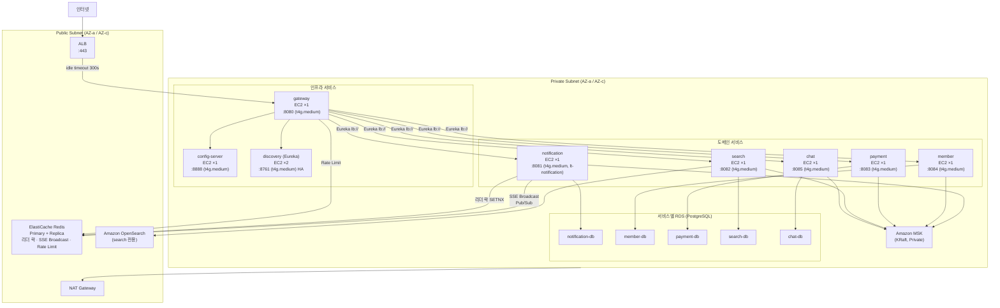
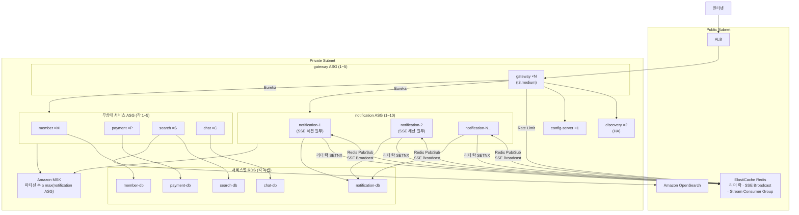

# AWS Scale-Out 아키텍처 설계도

> 기준: EC2 + Auto Scaling Group  
> 원칙: **기본 1개 인스턴스로 기동, 트래픽/부하 기준으로 선택적 수평 확장**  
> 인프라 변경 없이 앱 코드는 그대로 사용 (compose 환경 변수 → AWS 관리형 서비스로 치환)

---

## 1. 현재 구조 (docker-compose)

```
[클라이언트]
    ↓
[gateway :8080]  ← Eureka(lb://) 로드밸런싱
    ↓
config-server · discovery · member · payment · search · chat · notification
    ↓ 공유 인프라
postgres / redis / elasticsearch / kafka (단일 컨테이너)
```


---

## 2. AWS 매핑 전략

| 현재 (compose) | AWS 관리형 대체 | 비고 |
|---|---|---|
| postgres (단일) | **RDS PostgreSQL ×5** (서비스별 독립) | notification / member / payment / search / chat 각각 분리 |
| redis | **ElastiCache Redis** (Public Subnet, Primary + Replica) | SSE 세션 + 리더 락 + Rate Limit 공유 |
| elasticsearch | **Amazon OpenSearch** (Public Subnet) | search 서비스 전용, 8.x 호환 API |
| kafka | **Amazon MSK** (Private Subnet, KRaft) | `KAFKA_BOOTSTRAP_SERVERS` 환경 변수만 교체 |
| docker build | **Amazon ECR** | 서비스별 이미지 레포 (notification, member, payment, search, chat, gateway, config, discovery) |
| 진입점(8080) | **ALB** (Public Subnet) | 타겟 그룹 → gateway ASG |
| Eureka(8761) | **Eureka EC2 유지** (min=2 HA) | Cloud Map 전환은 운영 성숙 후 선택 |

---

## 3. 플랫폼 결정: EC2 + Auto Scaling Group

**선택 이유**
- notification의 `ulimits.nofile: 65535` / `sysctls.*` 커스텀이 Fargate에서 불가
- SSE 장기 연결(2분 타임아웃)에서 EC2 직접 제어가 안정적
- 기존 JVM 튜닝(`-XX:+UseZGC -Xmx2g`) 그대로 유지

**대안 비교**

| 항목 | EC2 + ASG | ECS Fargate | EKS |
|---|---|---|---|
| ulimit/sysctl 커스텀 | O | X | O |
| 인프라 관리 부담 | 높음 | 낮음 | 매우 높음 |
| SSE 스케일 세밀 제어 | O | 제한적 | O |
| 비용 (소규모) | 중간 | 중간 | 높음 |

---

## 4. Eureka vs Cloud Map

| | Eureka 유지 | Cloud Map 전환 |
|---|---|---|
| 코드 변경 | 없음 | gateway `lb://` → Route 53 DNS |
| 운영 부담 | Eureka 인스턴스 HA 필요 | AWS 완전 관리 |
| **권장** | 초기 단계 (코드 변경 최소화) | 운영 성숙 후 전환 |

> **초기 권장**: Eureka 유지. 단, Eureka 단일 인스턴스는 SPOF → discovery를 2대 이상(ASG min=2) 운영.

---

## 5. VPC / 네트워크 설계

```
Region: ap-northeast-2 (서울)

VPC: 10.0.0.0/16
│
├── Public Subnet (AZ-a 10.0.1.0/24, AZ-c 10.0.2.0/24)
│   ├── ALB (인터넷 진입점)
│   ├── NAT Gateway (Private → 인터넷 아웃바운드)
│   ├── ElastiCache Redis  ← 공유 캐시 / SSE 브로드캐스트
│   └── Amazon OpenSearch  ← search 서비스 전용
│
└── Private Subnet (AZ-a 10.0.11.0/24, AZ-c 10.0.12.0/24)
    ├── EC2: gateway            (ASG 1~5)
    ├── EC2: config-server      (ASG 1~2)
    ├── EC2: discovery(Eureka)  (ASG 1~2, min=2 HA)
    │
    ├── EC2: notification       (ASG 1~10)
    ├── EC2: member             (ASG 1~5)
    ├── EC2: payment            (ASG 1~5)
    ├── EC2: search             (ASG 1~5)
    ├── EC2: chat               (ASG 1~5)
    │
    ├── RDS: notification-db    (PostgreSQL, schema=notification)
    ├── RDS: member-db          (PostgreSQL, schema=member)
    ├── RDS: payment-db         (PostgreSQL, schema=payment)
    ├── RDS: search-db          (PostgreSQL, schema=search)
    ├── RDS: chat-db            (PostgreSQL, schema=chat)
    │
    └── Amazon MSK              (Kafka, 공유)
```

> **RDS 분리 이유**: MSA 원칙상 서비스 간 DB 직접 접근 차단. 각 서비스가 자신의 RDS만 접근 가능하도록 보안 그룹으로 강제.

**보안 그룹 규칙 (최소 권한)**

| SG 이름 | 인바운드 포트 | 소스 |
|---|---|---|
| sg-alb | 443 | 0.0.0.0/0 |
| sg-gateway | 8080 | sg-alb |
| sg-infra | 8761 (Eureka), 8888 (config) | sg-gateway, sg-app-\* |
| sg-app-notification | 8081 | sg-gateway |
| sg-app-member | 8084 | sg-gateway |
| sg-app-payment | 8083 | sg-gateway |
| sg-app-search | 8082 | sg-gateway |
| sg-app-chat | 8085 | sg-gateway |
| sg-redis | 6379 | sg-gateway, sg-app-\* |
| sg-opensearch | 9200 | sg-app-search |
| sg-msk | 9094 (TLS) | sg-app-\* |
| sg-rds-notification | 5432 | sg-app-notification |
| sg-rds-member | 5432 | sg-app-member |
| sg-rds-payment | 5432 | sg-app-payment |
| sg-rds-search | 5432 | sg-app-search |
| sg-rds-chat | 5432 | sg-app-chat |

---

## 6. Baseline 구성 (기본 1개 인스턴스)

모든 서비스 `desiredCapacity=1`, `minSize=1` (discovery만 min=2).

```
[인터넷]
    │ HTTPS 443
    ▼
[Public Subnet]
    ALB ──────────────────────────────────────────┐
    ElastiCache Redis (Primary + Replica)          │
    Amazon OpenSearch                              │
    NAT Gateway                                    │
                                                   │ HTTP 8080
[Private Subnet]                                   │
    EC2: gateway ×1  ◄────────────────────────────┘
         │  Eureka lb://
         ├──► EC2: config-server ×1  (8888)
         ├──► EC2: discovery(Eureka) ×2  (8761)   ← min=2, HA
         ├──► EC2: notification ×1  (8081)
         │         └─► RDS: notification-db
         ├──► EC2: member ×1  (8084)
         │         └─► RDS: member-db
         ├──► EC2: payment ×1  (8083)
         │         └─► RDS: payment-db
         ├──► EC2: search ×1  (8082)
         │         └─► RDS: search-db
         │         └─► OpenSearch (Public)
         └──► EC2: chat ×1  (8085)
                   └─► RDS: chat-db

    Amazon MSK ◄──── notification, member, payment, search, chat
```

**Launch Template — notification 전용** (다른 서비스와 분리)
```bash
# UserData
ulimit -n 65535
sysctl -w net.core.somaxconn=65535
sysctl -w net.ipv4.tcp_max_syn_backlog=65535
sysctl -w net.ipv4.tcp_max_syn_backlog=65535
sysctl -w net.ipv4.ip_local_port_range="32768 65535"
sysctl -w net.ipv4.tcp_tw_reuse=1
sysctl -w net.ipv4.tcp_fin_timeout=15
# JVM
export JAVA_TOOL_OPTIONS="-XX:MaxMetaspaceSize=256m -Xmx2g -XX:SoftMaxHeapSize=1800m -XX:+UseZGC -Dio.netty.maxDirectMemory=1073741824"
# 환경 변수는 SSM Parameter Store에서 주입
```

**EC2 인스턴스 타입 — 전 서비스 공통 `t4g.medium`**

| 항목 | 값 |
|---|---|
| 인스턴스 타입 | `t4g.medium` (ARM Graviton3, 2vCPU / 4GB) |
| Launch Template | **단일 공통 템플릿** — 서비스 추가/삭제 시 ASG만 생성·삭제 |
| notification JVM | `-Xmx2g` → 컨테이너 메모리 초과. **notification 전용 LT 분리 필수** (아래 참조) |

> **notification만 예외**: `-Xmx2g -Dio.netty.maxDirectMemory=1073741824` + ulimit/sysctl 커스텀 필요  
> → `lt-notification` (t4g.medium + UserData 포함) 별도 유지, 나머지 7개 서비스는 `lt-common` 공유

**RDS 인스턴스 타입 — 전 서비스 공통 `db.t4g.micro`**

| 항목 | 값 |
|---|---|
| 인스턴스 타입 | `db.t4g.micro` (2vCPU / 1GB) |
| 엔진 | PostgreSQL 18 |
| 서비스별 DB | notification-db / member-db / payment-db / search-db / chat-db |
| 추가 방법 | RDS 인스턴스 1개 생성 + sg-rds-{서비스} 보안 그룹 연결 |
| 삭제 방법 | RDS 인스턴스 삭제 + SG 삭제 |

**ALB Idle Timeout**: **300초** (기본 60초는 SSE ping 30s + timeout 120s 구간에서 연결 강제 종료)

---

## 7. Scale-Out 구성 (선택적)

### 7-1. 서비스별 스케일 특성

| 서비스 | 상태 유형 | 스케일 방식 | 스케일 트리거 |
|---|---|---|---|
| gateway | 무상태 | ASG 수평 확장 자유 | CPU 60% / 요청 수 |
| member | 무상태 | ASG 수평 확장 자유 | CPU 60% |
| payment | 무상태 | ASG 수평 확장 자유 | CPU 60% |
| search | 무상태 | ASG 수평 확장 자유 | CPU 60% |
| chat | 무상태 | ASG 수평 확장 자유 | CPU 60% / 연결 수 |
| **notification** | **상태 있음 (SSE 세션)** | **제약 있음 (아래 참조)** | SSE 연결 수 / CPU |
| config-server | 읽기 전용 | ASG 수평 확장 자유 | 거의 불필요 |
| discovery | 상태 있음 (Eureka 레지스트리) | min=2 (HA) | 거의 불필요 |

### 7-2. notification 스케일 아웃 — 안전 조건

notification은 다음 메커니즘으로 다중 인스턴스를 **이미 지원**한다.

**① SSE 연결 라우팅**
- 클라이언트 SSE 연결은 특정 인스턴스 A에 고정
- 알림 발행 시 `SseEmitterManager.send()` 가 Redis Pub/Sub(`notification:sse:send`)으로 broadcast
- `SseBroadcastSubscriber`가 모든 인스턴스에서 수신 → 자신에게 연결된 멤버면 `sendLocal()` 실행
- **결론**: ALB Sticky Session 불필요, N개 인스턴스 자유 확장 가능

**② 스케줄러 리더 선출**
- `ScheduledTriggerPublisher` 는 `SETNX notification:scheduler:leader 1 PX (4분)` 으로 리더 획득 후 트리거 발행
- N개 인스턴스 중 단 하나만 크론 실행 → 중복 실행 없음
- ElastiCache가 단일 진실 소스이므로 Redis HA(replica)가 필수

**③ Redis Stream Consumer Group**
- `StreamSubscriptionManager` 는 `XREADGROUP GROUP notification <hostname>-consumer` 로 파티셔닝
- 각 인스턴스가 다른 consumer name → Kafka 파티셔닝처럼 메시지 분산 처리
- **주의**: MSK 토픽 파티션 수 ≥ 최대 notification 인스턴스 수 (아니면 일부 컨슈머가 놀음)

**④ Redis Stream 구독**
- `StreamSubscriptionManager` 는 Redis Stream (`notification:events` 단일 스트림, `notification` consumer group)
- N개 인스턴스 → N개 consumer → 메시지 병렬 처리 (중복 없음)

### 7-3. Auto Scaling 정책

**notification ASG**
```
minSize: 1
maxSize: 10
desiredCapacity: 1

ScaleOut 조건 (OR):
  - CPU ≥ 60% (5분 평균)
  - sse_active_connections > 5000 (CloudWatch Custom Metric)
  - Kafka Consumer Lag > 10000

ScaleIn 조건:
  - CPU ≤ 30% (10분 평균)
  - sse_active_connections < 2000

Warmup: 120초 (JVM + Eureka 등록 대기)
```

**무상태 서비스 ASG (gateway, member, payment, search, chat)**
```
minSize: 1
maxSize: 5
ScaleOut: CPU ≥ 60% (3분 평균)
ScaleIn:  CPU ≤ 30% (5분 평균)
Warmup: 60초
```

---

## 8. 아키텍처 다이어그램

### Baseline (기본 — 서비스별 EC2 1개)



### Scale-Out (확장 시 — ASG 수평 확장)



---

## 9. 주요 운영 주의사항

### ALB Idle Timeout
```
notification ALB 타겟 그룹 idle timeout: 300초
  ← SSE timeout 120s + ping 30s 버퍼 충분히 확보
  기본값(60초)으로 두면 SSE 연결이 ALB에서 먼저 끊김
```

### MSK 토픽 파티션 수
```
notification 최대 인스턴스 수(maxSize=10) 이상으로 설정
예: 알림 토픽 파티션 = 12
  ← 파티션 < 컨슈머 수이면 일부 컨슈머가 할당 없이 대기
```

### ElastiCache Redis HA
```
Primary + Replica 최소 1개 구성
  ← 리더 락(SETNX)과 SSE 세션 레지스트리가 Redis에 의존
  Redis 장애 시 스케줄러 중복 실행 및 SSE 라우팅 실패
```

### notification ScaleIn 주의
```
ScaleIn 전 드레이닝 시간: 최소 120초
  ← SSE 연결 종료 + Eureka deregister 대기
  이 시간 이전에 인스턴스 종료 시 클라이언트 SSE 연결 강제 끊김
ASG Lifecycle Hook: terminating 이벤트에 120초 wait 설정
```

### Systems Manager Parameter Store
```
민감 환경변수 (POSTGRES_USER, POSTGRES_PASSWORD, REDIS_PASSWORD, JWT_SECRET)
  → SSM SecureString 저장 후 EC2 IAM Role로 주입
  → .env 파일 배포 금지
```

---

## 10. 마이그레이션 단계

| 단계 | 작업 | 비고 |
|---|---|---|
| 1 | VPC / Public Subnet / Private Subnet / SG 생성 | Terraform 권장 |
| 2 | **Public Subnet**: ElastiCache Redis (Primary+Replica), OpenSearch 프로비저닝 | |
| 3 | **Private Subnet**: RDS ×5 (notification/member/payment/search/chat 각각), MSK 프로비저닝 | 기존 단일 postgres → 서비스별 스키마 분리 후 마이그레이션 |
| 4 | ECR 레포 8개 생성 (서비스별) + 이미지 push | CI/CD 연동 |
| 5 | SSM Parameter Store에 민감 환경 변수 등록 | DB URL, Redis PW, JWT 등 서비스별 분리 |
| 6 | Launch Template 생성 | notification 전용 (ulimit/sysctl UserData 포함) / 나머지 공용 |
| 7 | config-server ASG 기동 (min=1) → discovery ASG 기동 (min=2, HA) | |
| 8 | 도메인 서비스 ASG 기동 (baseline: desiredCapacity=1) | 순서: notification → member → payment → search → chat |
| 9 | gateway ASG 기동 → ALB 타겟 그룹 등록 + **idle timeout 300초** 설정 | |
| 10 | CloudWatch Custom Metric (sse_active_connections) 연동 | Prometheus → CloudWatch Metric Streams |
| 11 | ASG Auto Scaling Policy 적용 (7-3 정책 기준) | notification ScaleIn Lifecycle Hook 120초 설정 |
| 12 | 부하 테스트 후 Scale-Out 검증 | k6/notification/run.sh |
