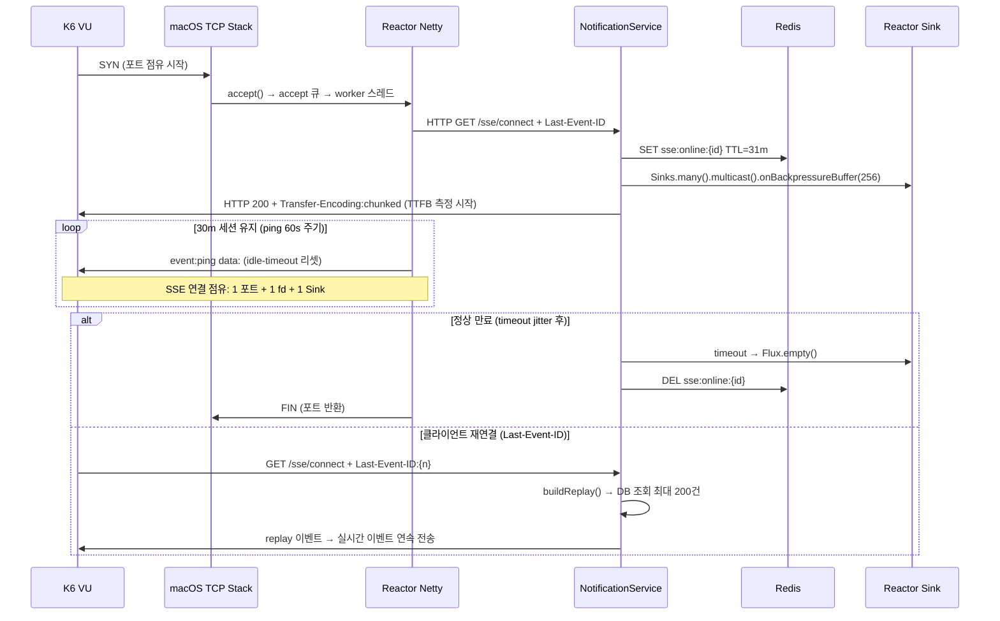

# SSE 부하 테스트 전 계층 아키텍처

> macOS 기준 24K VU SSE long-lived 커넥션 부하 테스트 전 스택 설정·연결 속성 레이어 다이어그램

---

## 전 계층 레이어 다이어그램

```mermaid
flowchart TD

    subgraph ZONE_CLIENT["★ CLIENT ZONE"]
        direction TB

        subgraph K6["K6 부하 생성기 (Go Runtime)"]
            direction TB
            K6_CFG["시나리오 설정
            ──────────────
            MAX_VUS: 24,000
            executor: ramping-vus / ramping-arrival-rate
            gracefulRampDown: 30s
            GOGC=50  |  GOMEMLIMIT=4GiB"]

            K6_SCENARIO["시나리오 구성
            ──────────────
            connect_ramp    : 0s~6m   연결 수립 속도
            sustain_ccu     : 2m~12m  CCU 동시 유지
            publish_single  : 2m~6m   단건 발행 TPS
            publish_broadcast: 3m~6m  브로드캐스트"]

            K6_METRIC["커스텀 메트릭
            ──────────────
            sse_connect_success / failed
            sse_accept_latency  p(95) lt 1000ms
            sse_server_disconnect count lt 1
            notify_publish_success_rate ge 0.99
            notify_publish_duration p(95) lt 300ms"]

            K6_CFG --> K6_SCENARIO --> K6_METRIC
        end

    end

    subgraph ZONE_OS["★ OS / NETWORK ZONE"]
        direction TB

        subgraph MACOS_OS["macOS 커널"]
            direction TB
            OS_PORT["Ephemeral Port 범위
            ──────────────
            기본: 49152~65535 (16,383 포트)
            설정: net.inet.ip.portrange.first=26000
            확보: 26000~65535 = 39,535 포트
            SSE = long-lived: VU 수 = 점유 포트 수
            24K VU → 24K 포트 동시 점유"]

            OS_FD["파일 디스크립터
            ──────────────
            kern.maxfiles=131072        시스템 전역
            kern.maxfilesperproc=131072 프로세스당
            ulimit -n 131072
            필요량: VU + 2000 = 26,000+"]

            OS_BACKLOG["TCP 백로그
            ──────────────
            kern.ipc.somaxconn=65535
            accept 큐 최대 대기열
            SYN flood 방어 및 연결 폭주 흡수"]

            OS_PORT --> OS_FD --> OS_BACKLOG
        end

        subgraph DOCKER["Docker 컨테이너"]
            direction TB
            DOCKER_NET["네트워크 브리지
            ──────────────
            host.docker.internal → Mac 루프백
            bridge 모드: NAT 오버헤드 발생
            --network=host 권장 (Linux 한정)"]

            DOCKER_ULIMIT["컨테이너 fd 한계
            ──────────────
            --ulimit nofile=131072:131072
            컨테이너 내부 ulimit 독립 관리
            docker-compose: ulimits.nofile"]

            DOCKER_MEM["메모리 / CPU
            ──────────────
            Kafka / Redis / PostgreSQL 분리 할당
            -m 2g / --cpus=2 권장
            JVM 힙 외 컨테이너 메모리 주의"]

            DOCKER_NET --> DOCKER_ULIMIT --> DOCKER_MEM
        end

        OS_BACKLOG -->|"소켓 accept 허용"| DOCKER_NET
    end

    subgraph ZONE_APP["★ APPLICATION ZONE"]
        direction TB

        subgraph NETTY["Reactor Netty"]
            direction TB
            NETTY_LOOP["이벤트 루프
            ──────────────
            worker-count: 16 (I/O 스레드)
            boss 스레드: accept 전담
            worker 스레드: read / write / encode
            Virtual Thread: spring.threads.virtual.enabled=true"]

            NETTY_CONN["연결 수명
            ──────────────
            connection-timeout: 30s  TCP 핸드셰이크 초과 종료
            idle-timeout: 210s       무데이터 시 종료
            SSE ping 60s → idle 타이머 리셋
            keepAlive: HTTP/1.1 기본 활성"]

            NETTY_BUF["버퍼 / 백프레셔
            ──────────────
            ByteBuf 풀링: PooledByteBufAllocator
            SSE 청크 인코딩 자동 적용
            Sink onBackpressureBuffer(256)
            초과 시 FAIL_FAST → emit_dropped 기록"]

            NETTY_METRIC["Netty 메트릭
            ──────────────
            management.server.netty.metrics=true
            reactor.netty.* → Micrometer → Prometheus
            active.connections 지표 모니터링"]

            NETTY_LOOP --> NETTY_CONN --> NETTY_BUF --> NETTY_METRIC
        end

        subgraph NIO["Java NIO / Reactor Core"]
            direction TB
            NIO_SCHED["스케줄러
            ──────────────
            boundedElastic: doFinally 세션 정리
            parallel: 기본 연산 파이프라인
            publishOn(boundedElastic): 블로킹 격리"]

            NIO_FLUX["Flux 파이프라인
            ──────────────
            Flux.concat(replay, sink.asFlux())
            .timeout(sessionTimeoutMs + jitter)
            .publishOn(boundedElastic)
            .doFinally(sessions.remove + redis.delete)
            .onErrorResume(TimeoutException, Flux.empty)
            .onErrorResume(*, counter.increment)"]

            NIO_R2DBC["R2DBC 비동기 DB
            ──────────────
            pool.initial=5 / max=20
            이벤트 루프 블로킹 없는 DB 조회
            replay: findByMemberIdAndIdGreaterThan"]

            NIO_SCHED --> NIO_FLUX --> NIO_R2DBC
        end

        subgraph APP["Spring WebFlux Application"]
            direction TB
            APP_PROPS["application.yml 핵심
            ──────────────
            server.port: 8081
            connection-timeout: 30s / idle-timeout: 210s
            worker-count: 16
            sse.timeout-ms: 1,800,000  30분
            sse.ping-interval-ms: 30,000
            channel.max-per-member: 2
            buffer.max-size: 200 / flush-interval: 500ms"]

            APP_SESSION["SSE 세션 관리 (SseEmitterManager)
            ──────────────
            저장소: ConcurrentHashMap (Long → SseSession)
            Sink: multicast().onBackpressureBuffer(256)
            TTL: timeout + jitter(-30s~+30s) + Redis 1m
            Redis Key: sse:online:{memberId}
            ping: @Scheduled(fixedRate=60_000) FAIL_FAST
            중복접속: previous.sink().tryEmitComplete()"]

            APP_REPLAY["last-event-id Replay
            ──────────────
            Last-Event-ID 헤더 → lastEventId 파싱
            DB 조회: REPLAY_LIMIT=200건
            Flux.concat(replay, sink.asFlux()) 순서 보장
            재연결 시 누락 이벤트 자동 보정"]

            APP_PROPS --> APP_SESSION --> APP_REPLAY
        end

        subgraph SSE_PROTO["SSE 프로토콜"]
            direction TB
            SSE_CONN["연결 수립
            ──────────────
            GET /sse/connect  HTTP/1.1
            Accept: text/event-stream
            Authorization: Bearer JWT
            → 200 + Transfer-Encoding: chunked
            → Content-Type: text/event-stream;charset=UTF-8"]

            SSE_ACK["ACK (연결 확인)
            ──────────────
            최초 응답: data:connected 또는 첫 ping
            TTFB = sse_accept_latency
            k6: completed / accepted / failed 분류"]

            SSE_PING["Heartbeat (ping)
            ──────────────
            event:ping  data:(empty)  60s 주기
            목적: idle-timeout 리셋 + 생존 확인
            무응답 → Netty idle 감지 → 연결 종료"]

            SSE_EVENT["이벤트 전송 포맷
            ──────────────
            id: {notificationId}
            event: notification
            data: {JSON payload}
            빈 줄로 이벤트 구분 (EventStream 규격)"]

            SSE_LAST["last-event-id 재연결
            ──────────────
            재연결: Last-Event-ID 헤더 자동 전송
            서버: lastEventId 이후 최대 200건 replay
            네트워크 단절 → 재연결 → 누락 없음"]

            SSE_LONGCONN["Long-lived 커넥션 특성
            ──────────────
            SSE = 연결 유지 = 포트 지속 점유
            VU 수 = 점유 포트 수 (1:1)
            24K VU → 24K 포트 + 24K fd 동시 점유
            TIME_WAIT 누적 없음 (서버 정상 종료 시)
            세션 만료(30m jitter) → 서버측 FIN"]

            SSE_CONN --> SSE_ACK --> SSE_PING --> SSE_EVENT --> SSE_LAST --> SSE_LONGCONN
        end

        NETTY_METRIC -->|"NIO Selector 위임"| NIO_SCHED
        NIO_FLUX -->|"Flux 파이프라인 구동"| APP_PROPS
        APP_SESSION -->|"청크 스트림 인코딩"| SSE_CONN
    end

    subgraph ZONE_INFRA["★ INFRA ZONE"]
        direction TB

        subgraph REDIS["Redis"]
            direction TB
            REDIS_SESSION["세션 레지스트리
            ──────────────
            Key: sse:online:{memberId}
            TTL: sessionTimeout + 1분
            isConnected() → EXISTS 확인
            다중 인스턴스 라우팅 핵심"]

            REDIS_PUBSUB["Pub/Sub 브로드캐스트
            ──────────────
            채널: sse-broadcast
            send() → PUBLISH → 구독 노드 → sendLocal()
            노드 간 SSE 이벤트 팬아웃"]

            REDIS_SESSION --> REDIS_PUBSUB
        end

        subgraph KAFKA["Kafka"]
            direction TB
            KAFKA_TOPICS["토픽 컨슈머
            ──────────────
            member.notif.push.v1
            chat.notif.push.v1
            payment.notif.push.v1
            group-id: notification
            auto-offset-reset: earliest"]
        end

        subgraph PG["PostgreSQL"]
            direction TB
            PG_REPLAY["알림 이력 / Replay
            ──────────────
            schema: notification
            replay 조회 / 알림 이력 저장
            R2DBC pool max-size: 20"]
        end

        REDIS_PUBSUB --> KAFKA_TOPICS --> PG_REPLAY
    end

    %% Zone 간 흐름
    K6_METRIC         -->|"24K TCP 연결 요청"| OS_PORT
    DOCKER_MEM        -->|"포트 포워딩 8081"| NETTY_LOOP
    SSE_LONGCONN      -->|"세션 등록 / 이벤트 팬아웃"| REDIS_SESSION
    KAFKA_TOPICS      -->|"이벤트 수신 → SSE emit"| APP_SESSION

    %% Zone 스타일
    style ZONE_CLIENT fill:#0d1117,stroke:#e94560,stroke-width:3px,color:#eee
    style ZONE_OS     fill:#0d1117,stroke:#3fb950,stroke-width:3px,color:#eee
    style ZONE_APP    fill:#0d1117,stroke:#58a6ff,stroke-width:3px,color:#eee
    style ZONE_INFRA  fill:#0d1117,stroke:#d2a8ff,stroke-width:3px,color:#eee

    %% 서브그래프 스타일
    style K6          fill:#161b22,stroke:#e94560,color:#eee
    style MACOS_OS    fill:#161b22,stroke:#3fb950,color:#eee
    style DOCKER      fill:#161b22,stroke:#3fb950,color:#eee
    style NETTY       fill:#161b22,stroke:#58a6ff,color:#eee
    style NIO         fill:#161b22,stroke:#58a6ff,color:#eee
    style APP         fill:#161b22,stroke:#58a6ff,color:#eee
    style SSE_PROTO   fill:#161b22,stroke:#58a6ff,color:#eee
    style REDIS       fill:#161b22,stroke:#d2a8ff,color:#eee
    style KAFKA       fill:#161b22,stroke:#d2a8ff,color:#eee
    style PG          fill:#161b22,stroke:#d2a8ff,color:#eee
```

---

## OS sysctl 설정 요약표

| sysctl 키 | 설정값 | 역할 |
|---|---|---|
| `net.inet.ip.portrange.first` | `26000` | Ephemeral 포트 시작점 → 가용 포트 39,535개 |
| `kern.maxfiles` | `131072` | 시스템 전역 fd 최대 |
| `kern.maxfilesperproc` | `131072` | 프로세스당 fd 최대 |
| `kern.ipc.somaxconn` | `65535` | TCP accept 큐 최대 대기열 |

> **포트 계산**: `net.inet.ip.portrange.first=26000` → 65535-26000+1 = **39,536 포트**
> 24K VU는 24,000 포트를 동시 점유하므로 여유 있으나, `net.inet.ip.portrange.first=39536`은 최대 **25,999 포트**만 확보 → 24K VU 상한 근접 주의

---

## 커넥션 생명주기 타임라인

---

## 병목 포인트별 진단 기준

| 계층 | 증상 | 확인 방법 | 임계값 |
|---|---|---|---|
| **OS 포트 고갈** | connect_failed 급증 | `netstat -an \| wc -l` | 가용 포트 < VU 수 |
| **OS fd 고갈** | `too many open files` 에러 | `ulimit -n` | < VU + 2000 |
| **TCP backlog** | SYN_RECV 적체 | `netstat -s \| grep -i overflow` | somaxconn < 연결 폭주율 |
| **Netty idle** | 연결 끊김 (idle-timeout) | `sse_server_disconnect` count | > 0 즉시 조사 |
| **Sink 드롭** | emit_dropped 메트릭 | Prometheus `sse_errors_total{reason=emit_dropped}` | > 0 |
| **Netty worker** | CPU 100% / 이벤트 루프 블로킹 | `reactor.netty.connection.provider.active.connections` | worker-count × 1000 초과 |
| **Redis 지연** | SSE 세션 등록 실패 로그 | Redis `LATENCY LATEST` | > 10ms |
| **JVM 힙** | heap-guard 발동 | `HEAP_THRESHOLD=90` 기준 | JVM 힙 90% 초과 |
